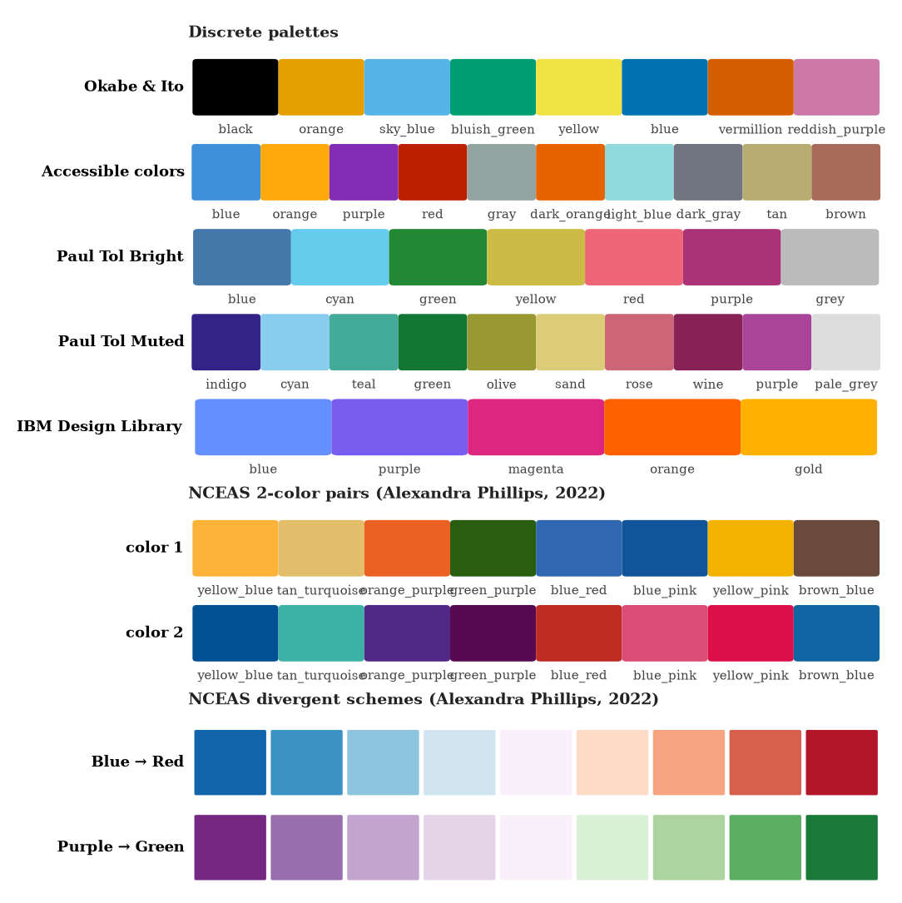
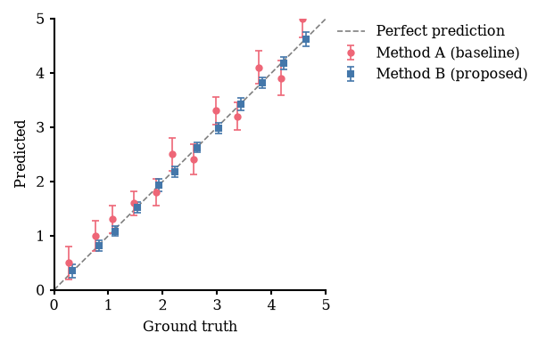

# Making beautiful plots for scientific papers

Disclaimer: I believe that the plots of a paper are like the blurb of a fantasy book. While the title and abstract convince the reader to click on the paper in the first place (like the cover design), the plots will decide whether they actually read, understand, and appreciate the paper.
Plots will either convince the reader of your claim or they will confuse them, cast doubt on your results, and leave them frustrated.

TL;DR: Your plots make or break your paper.

I hope this tutorial contains a few interesting details for everyone to improve their plotting game!
Let me know if you have things to add or if you do things differently.

**Just want Claude to follow these conventions without reading the whole tutorial?** Copy [`CLAUDE.md`](CLAUDE.md) into your project root. Claude Code picks it up automatically and will apply the plotting rules from this tutorial to every figure you make together. If your project already has a `CLAUDE.md`, paste the content in.

> This tutorial is inspired by @michaeldeistler's figure tutorial [mackelab/figure_tutorial](https://github.com/mackelab/figure_tutorial). I highly recommend checking it out in addition to this one. I wanted to prepare an extended version that covers the full workflow from data preparation to LaTeX integration, explains the reasoning behind each plotting choice more deeply, covers how plots evolve throughout a project, and includes a ready-to-use colorblind-friendly color palette package. The mackelab tutorial additionally explains how to sync your figures via git and how to compose multi-panel figures programmatically (using svgutils); I explain why I decided to do the latter in LaTeX instead.

---

## Contents of this repository

```
tutorial_making_beautiful_plots/
├── README.md                          ← this tutorial
├── CLAUDE.md                          ← drop this in your project to guide Claude Code
├── pyproject.toml                     ← pip install -e .
├── requirements.txt                   ← minimal dependencies (no pinned versions)
├── requirements_pinned.txt            ← exact pinned versions for reproducibility
├── cb_colors/                         ← colorblind-friendly color palettes
│   ├── __init__.py
│   └── palettes.py
├── cb_colors_overview/                ← all palettes visualized in one figure
│   ├── notebooks/plot_color_overview.ipynb
│   └── png/color_overview.png
├── matplotlibrc_ml                    ← style file for ML conferences (NeurIPS/ICML/ICLR)
├── matplotlibrc_physics               ← style file for physics journals (PRL, PRB, A&A)
└── example_plots/
    ├── 01_line_plot/                  ← method comparison over training
    │   ├── data/example_data.json
    │   ├── notebooks/plot_line_comparison.ipynb
    │   └── pdf/
    ├── 02_histogram/                  ← distribution comparison
    │   ├── data/example_data.json
    │   ├── notebooks/plot_histogram.ipynb
    │   └── pdf/
    ├── 03_scatter_with_errorbars/     ← predictions vs. ground truth
    │   ├── data/example_data.yaml
    │   ├── notebooks/plot_scatter.ipynb
    │   ├── pdf/
    │   └── png/
    └── z_backlog_plots/               ← plots that didn't make it into the paper
        └── exploratory_violin/
            ├── data/
            ├── notebooks/
            └── pdf/
```

## Quick start

```bash
git clone https://github.com/annalena-k/tutorial_making_beautiful_plots.git
cd tutorial_making_beautiful_plots

# Create and activate the dedicated plotting environment (see section 2.6 for why)
python3 -m venv venv_plotting
source venv_plotting/bin/activate      # on Windows: venv_plotting\Scripts\activate

# Install all plotting dependencies + the cb_colors package
pip install -e .

# Open a notebook
cd example_plots/01_line_plot/notebooks
jupyter lab
```

Then open `plot_line_comparison.ipynb` and run it. The figure is saved to `../pdf/fig_01.pdf`.

To recreate the exact same environment from the pinned lockfile:
```bash
python3 -m venv venv_plotting
source venv_plotting/bin/activate
pip install -r requirements_pinned.txt
```

---

## Table of contents

- [Making beautiful plots for scientific papers](#making-beautiful-plots-for-scientific-papers)
  - [Contents of this repository](#contents-of-this-repository)
  - [Quick start](#quick-start)
  - [Table of contents](#table-of-contents)
  - [1. The philosophy of plotting](#1-the-philosophy-of-plotting)
    - [What to ask yourself before plotting](#what-to-ask-yourself-before-plotting)
    - [Clutter is the enemy](#clutter-is-the-enemy)
    - [Every choice matters](#every-choice-matters)
    - [Iterate with collaborators](#iterate-with-collaborators)
  - [2. Plan how you plot: the workflow](#2-plan-how-you-plot-the-workflow)
    - [2.1 Summarize your data into small files](#21-summarize-your-data-into-small-files)
    - [2.2 Don't plot on the cluster](#22-dont-plot-on-the-cluster)
    - [2.3 Version control data, code, and figures](#23-version-control-data-code-and-figures)
    - [2.4 Folder structure](#24-folder-structure)
    - [2.5 Why I plot in notebooks](#25-why-i-plot-in-notebooks)
    - [2.6 Use a dedicated virtual environment](#26-use-a-dedicated-virtual-environment)
  - [3. The plotting process and its details](#3-the-plotting-process-and-its-details)
    - [3.1 The matplotlibrc file](#31-the-matplotlibrc-file)
    - [3.2 Installing the right fonts](#32-installing-the-right-fonts)
    - [3.3 Getting the right figure size](#33-getting-the-right-figure-size)
    - [3.4 Choosing colorblind-friendly colors](#34-choosing-colorblind-friendly-colors)
    - [3.5 Saving the figure](#35-saving-the-figure)
    - [3.6 Integrating figures into LaTeX](#36-integrating-figures-into-latex)
  - [4. Why you should make multiple versions of a figure](#4-why-you-should-make-multiple-versions-of-a-figure)
  - [5. How plots evolve during paper writing](#5-how-plots-evolve-during-paper-writing)
    - [Early exploration: many plots, most discarded](#early-exploration-many-plots-most-discarded)
    - [Many versions of the same plot: iteration is the process](#many-versions-of-the-same-plot-iteration-is-the-process)
    - [Figures get rearranged](#figures-get-rearranged)
    - [Some plots never make the final paper](#some-plots-never-make-the-final-paper)
    - [Figures in slides](#figures-in-slides)
    - [Referee revisions](#referee-revisions)
  - [6. The example plots](#6-the-example-plots)
  - [7. Citing papers and colormaps](#7-citing-papers-and-colormaps)
  - [8. Further reading](#8-further-reading)
  - [9. LLM usage disclaimer](#9-llm-usage-disclaimer)

---

## 1. The philosophy of plotting

Before touching any code, it's worth thinking hard about why and what you're plotting. A figure in a scientific paper is not just data, it is an argument designed to convince the reader of your story. The most technically correct plot can fail completely as a figure if it doesn't communicate effectively what you want to say.

### What to ask yourself before plotting

**What is the one message I want this plot to convey?**
Every good figure makes exactly one point which should be obvious to the reader just from looking at your plot. Choosing (a) the message you want to get across, and (b) the plot design that supports your claim are incredibly important, but oftentimes people "just start plotting".  
Especially since LLM tools can quickly generating myriads of different plots for you, it is essential that you know what you actually want to see and why. 
There are different strategies to get there: Some people might let their favourite LLM generate five different plots and pick the best for their message; I however need to sit down with pen and paper and sketch the figure myself while thinking through its design (Type of plot? Axes? Legend? Different colors or separate subplots? ...).

**Does this plot actually support my claim?**
Once you have an initial figure draft, it is easy to convince yourself that the plot shows what you think it shows. Before finalizing a figure, ask a collaborator how they interpret the plot. Let them think on their own and don't provide explanations, the figure needs to stand on its own. If they read a different message than you intended, or if they need explanations from you to get it, the figure doesn't work.
You need to go back to the drawing board and start from scratch, but maybe your colleague has ideas for you!

**Would I need a lot of explanation to make the reader understand?**
If yes, that's a sign the plot is too complex, the visual encoding is unclear, or the wrong type of chart was chosen. The best figures are largely self-contained: axes are clearly labeled with units, the legend is unambiguous, and the visual hierarchy guides the eye without narration.
If you find yourself with a plot that needs half a paragraph of caption before the reader can understand it, the plot isn't working. The best figures communicate their main message within seconds and also don't contain too much information. If you have multiple messages, consider whether they belong in separate panels, separate figures, or whether these messages are important at all for your storyline.

**Does careful presentation make the reader trust my results more?**
Yes. Sloppy plots (misaligned axes, clashing colors, unreadable font sizes, too many elements crammed in) make readers skeptical, even if the underlying science is correct. Beautiful, carefully made figures signal that the work behind them was equally careful. If you say "Why should I spend time making the figure beautiful, as long as it conveys the result, that's fine.", I can assure you that people enjoy looking at your figure more and for longer if it is pleasing to the eye. For example, I never use the standard matplotlib colors. Everyone knows them, sees them every day, and is simply bored by them. Intentionally choosing colors (which can be a time-consuming process) has always been worth it and I have received compliments for such choices. Making your figure beautiful also tells the reviewer: "This is not a preliminary result, but something ready for publication. I have so much faith into this result that I invested a significant amount of time into presenting it nicely. This is why you also should take it seriously and eventually trust the result."
Presentation is not superficial: it directly affects how your results are received.

### Clutter is the enemy
A common issue I have with peliminary (often LLM made) plots is that they contain each and every pieace of information, resulting in a lot of unnecessary clutter.
I believe that every element on a plot must earn its place. You can ask yourself: "What can I remove without losing information?" and remove it. This will make your plot cleaner, less confusing, and sharpen the message you want to convey.

Examples: 
- Grid lines often don't help the reader since the axes contain the same information. 
- Top and right spines are usually for decoration and are irrelevant, but add another line to the plot that the reader's brain must process. I always remove them (the matplotlibrc files in this repo do this by default). 
- Basically everything that competes for the reader's attention: Unnecessary tick marks that clutter the axes, the same legend in every subplot, overly detailed axis labels that are confusing, ...
  
All these things force the reader to spend their brain power on processing the details of the plot itself, instead of focussing on the message that you want to convey.

### Every choice matters

**Chart type**: "How do I want to show the data?" A line plot implies continuity. A bar chart implies discrete categories. A scatter plot suggests a relationship between two variables. Choosing the wrong type sends the wrong signal, even before the reader looks at the data.

**Axis ranges**: "What ranges make sense for my data?" Not only the maximal and minimal value matter, but also the scale: linear, log10, or ln can help to emphasize the feature you want to show. Think about what your reader needs to see.

**Labels and units**: Axis labels must include units where applicable and should be chosen to reflect the standard in the community of the target audience. Legend labels should be concise but unambiguous. Ideally, you can avoid abbreviations that require an explanation in the caption.

**Reference lines and guides**: A diagonal dashed line in a scatter plot comparing predictions to ground truth immediately tells the reader "perfect prediction lies on this line." Such guides can replace a sentence of caption. Use them when they help, but don't add lines without a reason.

**Colors and line styles**: See [section 3.4](#34-choosing-colorblind-friendly-colors). Color is one of the most powerful visual channels in scientific figures. Different line styles not only help color-blind people, but they are also important when someone prints your paper in black and white.

### Iterate with collaborators

After making a plot, show it to at least one other person before including it in the paper. 
Ask:
- "What does this plot tell you?" (don't explain it first)
- "What's confusing?"
- "How could the plot be improved?"

You'll often find that colleagues immediately notice things you've stopped seeing because you've been staring at the figure for hours. They might read a subtly different message than you intended. This feedback is invaluable and much cheaper to act on before submission than after. Ask your supervisor, a labmate, or a friend who knows the field. The goal is to get ideas for improvement.

---

## 2. Plan how you plot: the workflow

### 2.1 Summarize your data into small files

Don't plot directly on the cluster from raw model outputs or large simulation results. Instead, extract exactly the numbers you need and save them into small, human-readable summary files.

**Formats:** JSON, YAML, CSV, and plain TXT work well for scalars, lists, and tables. For larger arrays (samples, time series, images), HDF5 is a good choice. The key criterion is: the file should contain only what you actually plot, nothing more.

**Why:**
- Running your data pipeline or simply reading a large file from disk might take several minutes or hours. But a plot tweak (e.g changing the axis range, the color, the label) should take seconds. If plotting code loads the full model output, every tweak forces a long wait which quickly becomes frustrating and takes the fun out of making a beautiful plot.
- Summary files force you to explicitly think about about what you need to save for the plot. This is excellent reflection since it makes you think clearly about what the figure contains and what to compute in advance.
- Small files can be committed to git and therefore version controlled (more on this later).
- You can run all plotting locally, not on the cluster. This enables a fast, interactive iteration cycle (plus you don't block cluster resources).

**What to include in a summary file:** The data you actually plot, plus any metadata needed to reproduce the file. If you return to a project six months later, you should be able to understand what the file contains by reading it.

**Example:** Instead of loading 10 GB of samples to plot a histogram, compute the histogram on the cluster, save the bin edges and density values as a 2 KB JSON file, and plot that locally. The `02_histogram` example in this repo illustrates exactly this pattern.

### 2.2 Don't plot on the cluster

HPC clusters are optimized for computation, not visualization. Plotting there is painful:
- You typically don't have a display, so interactive debugging is impossible/difficult, requires tunneling, or a complicated setup.
- Matplotlib needs a non-interactive backend (Agg), and errors are hard to diagnose.
- The feedback loop is slow: submit job → wait in queue → job runs → download output → discover the axis label was wrong → repeat.
- You need a stable internet connection to access the cluster which means you can't quickly re-do the plot on the (German) train.
- You cannot iterate quickly, which means you settle for "fine" rather than improving the plot until it is "great."
- If the cluster is shut down for maintenance or some files cannot be accessed because a node got fried (This happened to me when I was writing a paper!), you cannot redo the plot because you can't access the data. This can be devastating if you have a submission deadline coming up.

From my experience of previous projects, results are updated very rarely while plots are updated often until all people on the paper are happy with them. I would estimate that in one of my projects, I updated the underlying data for one plot maybe four times, but iterated the plot at least 100 times. It is definitely worth it making these 100 iterations as quick and easy as possible.

Therefore, I can recommend doing all heavy computation on the cluster, extracting summary files, copying them to your local machine (or a shared folder), and doing all plotting there. A fast feedback loop where you see results immediately when you change something, is what makes iterative refinement of figures fun.

### 2.3 Version control data, code, and figures
Paper submissions are always stressful and it can leave you in shock when important things unexpectedly fail (which they will because of Murphy's law... sorry).
For example, the cluster could be down for maintenance, you accidentally deleted a notebook which contained plotting code you have already spent days on, or you tried to improve the figure, but now it looks worse and you already deleted the code. 
All these things are likely to happen and they can set you back significantly. This is the reason why I version control my plotting code and I want to recommend you the following:

Your plotting repository should be a git repository containing:
- The summary data files
- The plotting notebooks
- The output figures (PDFs)

**Yes, commit the PDFs.** PDF files are small (vector graphics, typically a few hundred KB), and having them in git means:
- You can always return to a previous version of any figure, without having to re-run the notebook.
- Collaborators can see the current state of all figures without running any code.
- When a referee asks "What was Figure 3 in the original submission?", you can answer immediately.

If your project has many or large binary files, you might not be properly constructing your summary files and it could be helpful to go back to [section 2.1](#21-summarize-your-data-into-small-files). If you really need these large files, consider git LFS. For typical PDF figures, regular git is fine.

**Tipp:** The plotting data (summary files), plotting code (notebooks), and figures (PDFs) should all be committed together. If you change the notebook and regenerate a figure, commit the new PDF at the same time. This keeps the repository consistent.

### 2.4 Folder structure

Each figure (or closely related group of figures) gets its own folder with the same internal structure:

```
{number}_{descriptive_name}/
├── data/           # summary data files — what goes into the figure
├── notebooks/      # one or more plotting notebooks
└── pdf/            # output PDFs — commit these to git
```

Number the top-level folders to match the figure numbers in the paper: `01_`, `02_`, etc. This makes it immediately clear where each paper figure comes from. For figures with labeled sub-panels (3a, 3b), use the subfolder naming `03a_`, `03b_`.

A `z_backlog_plots/` folder at the end (the `z_` prefix makes it sort last) should contain plots that didn't make it into the paper. It's always a good idea to just move a plotting folder into the backlog when it is deemed not important enough, but I would never delete them — see [section 5](#5-how-plots-evolve-during-paper-writing) for details.

### 2.5 Why I plot in notebooks

Jupyter notebooks are excellent for iterative figure making:
- The figure appears inline, immediately below the code that generated it. You can see the result of every change without leaving the editing environment.
- You can run individual cells without re-running everything. Tweak the color in one cell, re-run just that cell.
- The notebook serves as living documentation: you can add markdown cells explaining what you tried, why a particular choice was made, or what a failed approach looked like.
- Multiple versions of a cell (commented out) let you preserve the history of your decisions.

I recommend only using one notebook per figure (or per closely related group of figures) because this keeps everything clear and simple. You only load the essential data files and make the one essential plot.
At the beginning, I thought that this is would generate a lot of notebooks with little content, but I was surprised how long the notebooks got over time (different versions of the same plot, cross-checks, small tweaks, ...). The notebook lives in `notebooks/` inside the figure folder and saves its output to `pdf/`.

> **Note on LLM tools:** Coding assistants like Claude are changing how quickly one can iterate on figures since you can describe what you want, get working code immediately, and refine from there. In the future, this might shift the workflow toward plain Python scripts over notebooks. For now, the interactive notebook workflow remains excellent for the exploratory, visual work of making figures which allows manual editing when needed.

### 2.6 Use a dedicated virtual environment

**Use a separate Python virtual environment for plotting and version-control the pinned package list.**

This sounds like extra overhead, and early in a project it feels that way. But it matters since it can take quite some time from first plots to published paper.

**Why:** Plotting libraries (like `matplotlib`, `numpy`, `seaborn`) release new versions that change default behaviors, color cycles, layout algorithms, and font rendering. A figure you made in `matplotlib==3.7` can look noticeably different when re-run in `matplotlib==3.9`: tick spacing shifts, default colors change, font metrics differ slightly. If you have a single shared Python environment that you update constantly, your plots will silently drift. By the time you submit the reviewed version of the paper, the figures in the PDF may not match what you had included in your initial submission (This could be >6 months later!).

**The solution:** Create a dedicated venv for plotting, install everything once, and freeze the exact versions:

```bash
python3 -m venv venv_plotting
source venv_plotting/bin/activate
pip install -e .                          # installs dependencies from pyproject.toml
pip freeze > requirements_pinned.txt      # pin all exact versions
```

Commit `requirements_pinned.txt` to git. Do **not** commit `venv_plotting/` itself (it's in `.gitignore`). Anyone who clones the repo and wants to reproduce exactly what you saw can run:

```bash
python3 -m venv venv_plotting
source venv_plotting/bin/activate
pip install -r requirements_pinned.txt
```

**When to update:** When you want a new package version, update explicitly, re-test your figures, and commit the new `requirements_pinned.txt`. That way the update is a deliberate, documented change and not a silent drift.

**In JupyterLab:** Select the venv as the kernel by name (`venv_plotting`). If it doesn't appear, you can register it via:
```bash
source venv_plotting/bin/activate
pip install ipykernel
python -m ipykernel install --user --name venv_plotting --display-name "venv_plotting"
```

---

## 3. The plotting process and its details

### 3.1 The matplotlibrc file

Matplotlib's default style is fine for quick exploratory plots but not for publication figures. A `matplotlibrc` file lets you configure all visual parameters (fonts, sizes, spines, tick marks, line widths, save settings) once, and have them apply to every plot automatically.

This repository includes two style files:
- **`matplotlibrc_ml`** — for ML conference papers (NeurIPS, ICML, ICLR). Uses Computer Modern fonts without a LaTeX installation. Font size 7.5 pt (matches NeurIPS body text).
- **`matplotlibrc_physics`** — for physics journals (PRL, PRB, MNRAS, A&A). Uses full LaTeX rendering with CMU Serif fonts. Font size 9.0 pt (matches PRL body text).

**How to use it**: At the top of every plotting notebook, before any other matplotlib import, include:

```python
import matplotlib
matplotlib.rc_file("../../matplotlibrc_ml")  # adjust path as needed

import matplotlib.pyplot as plt
import numpy as np
```

**What it configures:**

| Setting | Value (NeurIPS) | Why |
|---|---|---|
| `font.size` | 7.5 pt | Matches paper body text |
| `font.family` | serif | Matches paper font family |
| `font.serif` | Computer Modern | Matches LaTeX default |
| `axes.spines.top/right` | False | Removes decorative spines |
| `axes.grid` | False | Removes clutter |
| `lines.linewidth` | 1.0 | Thin lines look better in print |
| `xtick.major.size` | 2.5 | Smaller ticks for publication |
| `savefig.format` | pdf | Vector output for LaTeX |
| `savefig.bbox` | tight | Removes extra whitespace |
| `legend.frameon` | False | No box around legend |

The overarching goal: your figure should blend seamlessly into the paper text. Same font, same font size, same visual weight. When a reader does not consciously notice the transition from text to figure, that is a success.

### 3.2 Installing the right fonts
**Font vs. rendering:** Font and rendering control how the actual characters in your figure are set on the page. This is a whole field of study in itself (that I will not go into), but they are highly relevant for visual consistency.

**Why fonts matter:** If your figure uses a different font than the paper's body text, it looks like a foreign object pasted into the document which every reviewer notices. Matching the font creates visual coherence that the reader may not consciously be aware of, but they will feel the consistency. Depending on the TeX template provided by the journal/conference you want to submit to, you will need a different font. Common machine learning conferences use `Computer Modern` (see `matplotlibrc_ml`) while physics journals depend on `serif` fonts (see `matplotlibrc_physics`).

**Why TeX rendering might make a difference:** The `matplotlibrc_ml` explicitely sets `text.usetex: False` because it is usually not necessary. However, several greek characters look visually different if they are written in a specific font, or if they rendered with a LaTeX backend. As a result, a greek letter in your text might look differently than the same greek letter in your axis label. To avoid such differences, you can enable TeX within the matplotlibrc file by setting `text.usetex: True` which uses your system's LaTeX installation to render all text, including axis labels, tick labels, and legends. Since this usually matters more for physics papers, `matplotlibrc_physics` uses `text.usetex: True`.

Requirements:
1. A working LaTeX installation — [MacTeX](https://www.tug.org/mactex/) (macOS) or [TeX Live](https://www.tug.org/texlive/) (Linux/Windows)
2. The **CMU Serif** (Computer Modern Unicode) font installed on your system

Installing CMU Serif on macOS:
```bash
brew install --cask font-cm-unicode
```

Or download from: https://cm-unicode.sourceforge.io/

After installing a new font, refresh matplotlib's font cache (run once):
```python
import matplotlib.font_manager
matplotlib.font_manager._load_fontmanager(try_read_cache=False)
```

**Why you might need to change the font for slides and posters:**
Some fonts are designed such that they are optimally readable when printed on paper (`serif`), others are easiest to read on screens (`Computer Modern`). As a result, plots prepared with the journal font can look weird or even ridiculous on slides or posters. For example, bullet points on a slide with `serif` font are very hard to read and the text can look weird. If you want your figures to be consistent with your slides, you might need to make a figure version with your slide font.

```python
matplotlib.rcParams.update({
    "font.family": "sans-serif",
    "font.sans-serif": ["Helvetica", "Arial"],
})
```

### 3.3 Getting the right figure size

**Why it matters:** If you don't explicitly set the figure size to match the journal column width, the font sizes in your figure will not match the paper. Either the text in the figure will be too large (looks amateurish and wastes space) or too small (unreadable, forces squinting). The only way to guarantee a match is to set the figure width to exactly the column width of your target journal.

**The rule:** Save the figure at the exact width it will be displayed in the paper. Then include it with `\includegraphics[width=\columnwidth]{...}` in LaTeX without rescaling.

**How to find the column width of your target journal:**

1. Look in the journal's LaTeX template or style guide.
2. Add `\printinunitsof{in}\prntlen{\textwidth}` to your `.tex` file (requires the `printlen` package) to print the actual text width at compile time.
3. Look in the journal's `.cls` file for `\setlength{\textwidth}{...}`.
4. Ask Google or your favourite LLM.

**Common values (in inches):**

| Journal / Conference | Single column | Full text width |
|---|---|---|
| NeurIPS (2024)       | 5.5 in        | 5.5 in (single column layout) |
| ICML                 | 3.25 in       | 6.75 in |
| PRL / PRB            | 3.375 in      | 6.75 in |
| MNRAS                | 3.32 in       | 6.97 in |
| A&A                  | 3.54 in       | 7.28 in |

To convert from points to inches: `inches = pt / 72`.

**In code:**
```python
COLWIDTH = 3.375   # PRL single-column width in inches
ASPECT   = 3 / 4  # height / width — modify to reflect your figure design

fig, ax = plt.subplots(figsize=(COLWIDTH, COLWIDTH * ASPECT))
```

For a two-panel figure where each panel is its own PDF:
```python
# Each panel is saved separately at half the text width
TEXTWIDTH = 6.75
fig, ax = plt.subplots(figsize=(TEXTWIDTH / 2 - 0.05, (TEXTWIDTH / 2) * ASPECT))
# The 0.05 in leaves a small gap between panels when assembled in LaTeX
```

**Note on `savefig.bbox: tight`:** This setting (on by default in the matplotlibrc files here) trims excess whitespace around the figure and can subtly change the saved size. For most figures this is fine. If you need pixel-perfect sizing, use `savefig.pad_inches: 0` and consider turning off `bbox: tight` for that specific save call.

### 3.4 Choosing colorblind-friendly colors

**Why it matters:** Approximately 8% of men and 0.5% of women have some form of color vision deficiency ([Okabe & Ito, 2008](https://jfly.uni-koeln.de/color/); [Simunovic, 2010](https://doi.org/10.1038/eye.2009.251)). The most common type (red-green, or deuteranopia) makes red and green appear nearly identical. If your plot distinguishes two lines with red vs. green (the most common color choice in scientific figures), a significant fraction of your readers cannot read it. This is not a minor accessibility concern: If ten people look at your paper, it is highly likely that at least one of them has a color deficiency!
Something similar happens when someone prints your paper in black and white to save printer ink: The lines in the plot might not be distinguishable.

Beyond accessibility, well-chosen colors look better to everyone. Carefully selected palettes have pleasing contrast, visual balance, and purpose. 

**How to choose colors:** Ideally, your color choices are consistent across (sub)plots. For example, if you compare three versions of approaches/methods/models, each one should have a distinct color that you stick with for the whole paper. Of course, this requires careful selection: Ideally, you know all plots that you want to include in the paper. Then you sit down, collect all color combinations you need, and try to find suitable colors for each plot such that everything makes sense together. This process might take quite some time and effort

**What to avoid:** The default matplotlib color cycle is not designed with color blindness in mind. The `jet` colormap is a notorious example of a colormap that should essentially never be used (poor perceptual uniformity, terrible for color-blind readers). Red vs. green is the most common mistake in scientific plots.

**The `cb_colors` package** (included in this repository) provides several research-validated colorblind-safe palettes:

```python
from cb_colors import palettes

# Most widely recommended — 8 colors, tested under all common deficiency types
c = palettes.okabe_and_ito()
# Keys: "black", "orange", "sky_blue", "bluish_green", "yellow",
#        "blue", "vermillion", "reddish_purple"

# Good for multiple categories, clean and vibrant
c = palettes.paul_tol_bright()
# Keys: "blue", "cyan", "green", "yellow", "red", "purple", "grey"

# Softer tones, good for filled areas and overlapping distributions
c = palettes.paul_tol_muted()
# Keys: "indigo", "cyan", "teal", "green", "olive", "sand",
#        "rose", "wine", "purple", "pale_grey"

# 10-color accessible scheme for when 8 colors aren't enough
c = palettes.accessible_colors()

# 8 two-color pairs for paired comparisons (Alexandra Phillips / NCEAS, 2022)
pairs = palettes.nceas_two_color_pairs()
color_a, color_b = pairs["blue_red"]

# Divergent colormaps (9 stops, blue→white→red or purple→white→green)
btr = palettes.nceas_blue_to_red()    # list of 9 hex strings
ptg = palettes.nceas_purple_to_green()
```

All discrete palettes return dicts mapping descriptive names to hex strings:
```python
c = palettes.okabe_and_ito()
print(c["blue"])   # → "#0072b2"
```

**Usage example:**
```python
c = palettes.okabe_and_ito()

ax.plot(x, y_a, color=c["sky_blue"],   label="Method A")
ax.plot(x, y_b, color=c["vermillion"], label="Method B")
```

**Color palette overview** — all palettes included in `cb_colors`:



**Don't rely on color alone.** Also vary the line style (solid, dashed, dotted) or marker type. This makes the figure readable when printed in grayscale (still common in physics journals) and adds a second visual channel to distinguish groups. See the `02_histogram` and `03_scatter_with_errorbars` notebooks for examples.

**Testing for colorblindness:** Paste your figure into the [Coblis simulator](https://www.color-blindness.com/coblis-color-blindness-simulator/) or use the Python package `daltonize`. If you can still distinguish all elements under deuteranopia simulation, you're in good shape.
Before submitting your paper, print it once in black and white colors to check whether the colors are perceived as you expected.

### 3.5 Saving the figure

```python
fig.savefig("../pdf/fig_01.pdf", transparent=True)
```

**PDF as the preferred format:** Always save as PDF for figures that go into a LaTeX paper. PDF is a vector format: it scales to any resolution without pixelation, and the file size stays small (a few hundred KB for most scientific figures). This makes it easy to commit to git and trivial to include in LaTeX.

**Transparent background** (`transparent=True`): Saves the figure with no background fill. This is important for:
- Dark-themed slides: the figure doesn't have a white box around it
- Figures placed on colored backgrounds in posters or talks
- General cleanliness — the figure background matches whatever it's placed on

**The matplotlibrc files in this repo already set:**
```
savefig.format       : pdf
savefig.bbox         : tight    ← trims whitespace
savefig.dpi          : 500      ← affects rasterized elements (images in figures)
savefig.pad_inches   : 0.1      ← small padding inside the tight boundary
```

So `plt.savefig("../pdf/fig_01.pdf")` will use all these settings automatically. I pass `transparent=True` explicitly because I want it to be visible in the notebook cell, not hidden in the rcParams.

**For PNG (slides, web):** In general, I don't recommend plotting figures as PNG since it is a raster format. However, sometimes you need small figure sizes for slides or the web. To make sure it still renders sufficiently well, you need to set a high DPI:
```python
fig.savefig("../pdf/fig_01_slides.png", dpi=300, transparent=True)
```
300 DPI at the displayed size (e.g. 5 inches wide) gives 1500 px, which is sharp on standard and retina screens.

### 3.6 Integrating figures into LaTeX

Rather than composing multi-panel figures in Python using `svgutils` (as the [mackelab tutorial](https://github.com/mackelab/figure_tutorial) shows), I assemble subfigures entirely in LaTeX. This approach has important advantages:

- **Panels can be updated independently**: if one panel changes, replace one PDF file. The LaTeX layout updates automatically.
- **Pure vector output**: the entire assembled figure — panels, insets, subfigure labels (a), (b) — is rendered as vector graphics by LaTeX's PDF engine.
- **Layout changes are one-line edits**: swapping the order of panels or adjusting spacing is a change to the LaTeX code, not a Python re-run.
- **Overlays in LaTeX coordinate space**: inset figures, legend boxes, and text annotations can be placed precisely on top of another PDF using LaTeX commands, without any Python composition.

**Required preamble:**
```latex
\usepackage{subfig}       % for \subfloat
\usepackage{stackengine}  % for \stackinset (overlaying content on a figure)
```

**Single full-width figure:**
```latex
\begin{figure}[t]
    \centering
    \includegraphics[width=\textwidth]{figures/fig_01.pdf}
    \caption{Caption here.}
    \label{fig:fig1}
\end{figure}
```

**Two-panel figure spanning both columns** (use `figure*` for full text width in two-column journals like PRL):
```latex
\begin{figure*}[t]
    \begin{minipage}[t]{.48\textwidth}
        \subfloat{
            \stackinset{l}{0cm}{t}{0cm}{\textbf{a}}{
                \includegraphics[width=\textwidth]{figures/fig_02a.pdf}
            }
        }
    \end{minipage}
    \hfill
    \begin{minipage}[t]{.48\textwidth}
        \subfloat{
            \stackinset{l}{0cm}{t}{-0.2cm}{\textbf{b}}{
                \includegraphics[width=\textwidth]{figures/fig_02b.pdf}
            }
        }
    \end{minipage}
    \caption{(a) Left panel narrative. (b) Right panel narrative.}
    \label{fig:main}
\end{figure*}
```

The `\stackinset{anchor_h}{offset_h}{anchor_v}{offset_v}{overlay}{base}` command places `overlay` on top of `base` at the specified position. Panel labels (**a**, **b**) are placed this way which means they use the paper's font and are part of the compiled PDF, not baked into the Python figure. This makes it easy to re-arrange subplots without having to regenerate the figure in Python.

**Advanced: overlaying multiple PDFs on one panel.** When a panel contains insets (e.g. a corner plot together with a skymap and a separate legend saved as its own PDF), nest multiple `\stackinset` calls:

```latex
\begin{minipage}[t]{.48\textwidth}
    \subfloat{
        \stackinset{l}{0cm}{t}{0cm}{\textbf{a}}{%        ← panel label
        \stackinset{l}{3cm}{t}{0cm}{Annotation text}{%   ← text overlay
        \stackinset{l}{2.8cm}{t}{0.16cm}{%               ← legend inset
            \includegraphics[width=0.28\textwidth]{figures/fig_03a_legend.pdf}%
        }{%
        \stackinset{l}{4.8cm}{t}{0.2cm}{%                ← skymap inset
            \includegraphics[width=0.4\textwidth]{figures/fig_03a_skymap.pdf}%
        }{%
            \includegraphics[width=\textwidth]{figures/fig_03a_corner.pdf}%  ← base
        }}}}%
    }
\end{minipage}
```

Each `\stackinset` wraps the previous one. The innermost (deepest nesting) is always the base figure; everything else is layered on top. This way a panel that visually shows a corner plot, a skymap inset, a separate legend, a text annotation, and a panel label is still just four independent PDF files where each can be updated on its own.

**Key insight for font size matching:** When you save a figure at exactly `\textwidth` width (or `0.48\textwidth` for a half-width panel) and include it with `\includegraphics[width=\textwidth]{...}` at the same fraction, the LaTeX compiler scales it by a factor of 1. The font size in the figure (e.g. 9 pt) will be exactly 9 pt in the compiled PDF. This only works if you set the figure width in Python to match the journal's column width. See [section 3.3](#33-getting-the-right-figure-size).

---

## 4. Why you should make multiple versions of a figure

A single figure typically needs to exist in several versions:
- **Paper version**: exact journal column width, small font, PDF
- **Slides version**: wider and taller, larger font (readable from the back of a room)
- **Dark background version**: for dark-themed presentations (requires white labels, ticks, spines, and legend)
- **Different journal format**: different column width and font size if you submit elsewhere

I manage this with a `VERSION` variable at the top of each notebook:

```python
VERSION = "paper"   # "paper" | "slides" | "dark"

if VERSION == "paper":
    FIGWIDTH    = 3.375   # PRL column width
    FONT_SIZE   = 9.0
    SUFFIX      = ""
    TRANSPARENT = True
elif VERSION == "slides":
    FIGWIDTH    = 5.0
    FONT_SIZE   = 14.0
    SUFFIX      = "_slides"
    TRANSPARENT = False
elif VERSION == "dark":
    FIGWIDTH    = 5.0
    FONT_SIZE   = 14.0
    SUFFIX      = "_dark"
    TRANSPARENT = True

matplotlib.rcParams.update({"font.size": FONT_SIZE})
```

Changing `VERSION` and re-running the notebook regenerates the figure for a different target. All versions live in `pdf/` with distinguishing suffixes:
```
pdf/
├── fig_01.pdf               ← paper version (no suffix = canonical)
├── fig_01_slides.pdf        ← slides version
└── fig_01_dark.pdf          ← dark background for talks
```

For the dark version, text and spine colors also need to change:
```python
if VERSION == "dark":
    BG = "#1c1c2e"
    FG = "white"
    fig.patch.set_facecolor(BG)
    ax.set_facecolor(BG)
    ax.tick_params(colors=FG)
    ax.xaxis.label.set_color(FG)
    ax.yaxis.label.set_color(FG)
    for spine in ax.spines.values():
        spine.set_edgecolor(FG)
    # Update legend text color if needed:
    for text in ax.get_legend().get_texts():
        text.set_color(FG)
```

---

## 5. How plots evolve during paper writing

It was important for me to realize that the final figures in a paper look nothing like the first plots I made during a project. Understanding this helped me not get discouraged early on and allowed me to organize my work so I can find things later.

### Early exploration: many plots, most discarded

At the start of a project, you don't know what the final figures will be. You make many exploratory plots which are different representations of the same data, different aspects to highlight, different hypotheses just to test how they look like. Most of these plots will never appear in the paper.

This is expected and healthy. Each plot teaches you something about the data. I keep some of them in `z_backlog_plots/` because I might need them later, they might spark an idea, or they document a dead end that saves someone (including future me) from repeating it.

### Many versions of the same plot: iteration is the process

For a single figure that ends up in the paper, you will likely make 10–15 different versions before settling on the right visualization. Maybe you start with a scatter plot, try a line plot, realize a histogram communicates the point better, then spend three sessions adjusting the binning, axis range, color scheme, and label positions.
Once you think you are done, a colleague suggests removing a certain category from the plot because it doesn't fit the story and you have to redo the figure from this new perspective. 

It's easy to get frustrated, but these iteration will make your plot better. The `pdf/` folder will accumulate these versions. Keep them. Use suffixes like `_v1`, `_v2` or the date in the filename if you want to track the evolution. Remove old versions when you are certain you don't need them.

### Figures get rearranged

As the paper narrative develops, figures move around. What was Figure 2 becomes Figure 4, and a new Figure 2 is created. Panels get combined or split. A figure that was one plot becomes a two-panel comparison.

The numbered folder names may no longer match the paper figure numbers — that's fine. I recommend, you rename the folder when convenient, but don't waste time on perfect bookkeeping during active writing. The key is that each folder clearly describes what it contains (`02_histogram`, `03_scatter_with_errorbars`) so you can find things by description, not just by number.

### Some plots never make the final paper

Sadly, this happens on every project. A visualization you spent hours on doesn't convey the point clearly enough, or it shows something the paper doesn't need to show, or the paper gets reorganized and the figure no longer fits the narrative. 
If you have space constraints, don't hesitate to move supportive or less relevant results to the Appendix. You can still reference these plots, but you need to distill which message/figure deserves a spotlight in the main text.
If a figure isn't relevant enough for the Appendix, move it to `z_backlog_plots/` and don't feel bad about it, it might help you in the future (e.g. when preparing slides).

The backlog is not a trash folder but a summary of not-important-enough figures. Referees sometimes ask for additional analyses that you already explored and plotted, but didn't deem relevant enough; the backlog lets you find that work quickly.

### Figures in slides

When you give a talk about the paper, you often need different figures. Conference talks need slides-format versions (wider, larger font, possibly fewer panels or none at all). Tutorial talks might need simplified versions showing fewer curves. Sometimes a visualization that works beautifully in a paper (dense information, small font) fails on a slide, and you need to redesign it.

These presentation-specific figures either live alongside the paper figures (with `_slides` or `_talk` suffixes in the `pdf/` folder) or in a separate `presentations/` folder alongside `example_plots/`.

### Referee revisions

Referees will ask for additional analyses, replotted comparisons with new baselines, or modified visualizations. Having the data and code organized in a clean folder structure means these revisions are fast: find the folder, update the data file or adjust the notebook, regenerate. If the figures are in git, you can also compare the before-and-after trivially.

---

## 6. The example plots

The three examples in `example_plots/` are not just toy demos — each was chosen to represent a distinct plot type that comes up in almost every ML or physics paper, and each illustrates a specific set of design challenges.

**01 — Line plot: method comparison over training**  
`01_line_plot/` shows multiple methods plotted against a shared x-axis (e.g. training epochs or time). This is arguably the most common figure type in machine learning papers. The design challenges here are: choosing colors that remain distinguishable at small print sizes, placing the legend without it overlapping the curves, and picking axis ranges that focus attention on the relevant regime rather than on uninformative tails.

**02 — Histogram: distribution comparison**  
`02_histogram/` compares two overlapping distributions. Histograms are deceptively tricky: the bin width dramatically changes what the reader sees, alpha blending must be chosen carefully for overlapping fills, and the legend placement becomes important when both distributions occupy the same region. This example also illustrates how to summarize raw samples into a small JSON file (bin edges + density values) so that re-plotting is instant.

**03 — Scatter plot with error bars: predictions vs. ground truth**  
`03_scatter_with_errorbars/` shows model predictions against ground truth with uncertainty estimates, a reference diagonal, and a separate residual panel below. This represents the "result summary" figure that often carries the main claim of the paper. The key design choices here are: using a reference line that communicates the ideal outcome without dominating the figure, error bars that are visible but not distracting, and matching axis ranges across the two panels.



Each notebook contains a `VERSION` switch at the top (`"paper"` / `"slides"` / `"dark"`) so you can regenerate the same figure in different formats with a single variable change. See [section 4](#4-why-you-should-make-multiple-versions-of-a-figure) for the rationale.

---

## 7. Citing papers and colormaps

Since it is a lot of work to design colorblind friendly color schemes and write nice plotting packages, I would like to ask you to cite the color schemes and packages you used to create your figures.
This is the only way we can show appreciation for such important work.
Additionally, a citation might inspire your readers to adopt the same color schemes!

Depending on which palettes you use from `cb_colors`, cite the appropriate original source:

| Palette | Citation |
|---|---|
| `okabe_and_ito` | Okabe, M., & Ito, K. (2008). *Color universal design (CUD): How to make figures and presentations that are friendly to colorblind people.* [jfly.uni-koeln.de/color](https://jfly.uni-koeln.de/color/) (Original work published 2002) |
| `paul_tol_bright`, `paul_tol_muted` | Tol, P. (2021). *Paul Tol's Notes: Introduction to Color Schemes.* [personal.sron.nl/~pault/](https://personal.sron.nl/~pault/data/colourschemes.pdf) |
| `accessible_colors` | Petroff, M. A. (2021). *A hitchhiker's guide to choosing colors for scientific figures.* [arXiv:2107.02270](https://arxiv.org/abs/2107.02270) |
| `ibm_design_library` | IBM Design Language — Color. [ibm.com/design/language/color/](https://www.ibm.com/design/language/color/) |
| `nceas_two_color_pairs`, `nceas_blue_to_red`, `nceas_purple_to_green` | Phillips, A. (2022). *Colorblind Safe Color Schemes.* NCEAS Science Communication Resource Corner. [nceas.ucsb.edu](https://www.nceas.ucsb.edu/sites/default/files/2022-06/Colorblind%20Safe%20Color%20Schemes.pdf) |

If you use `matplotlib`, you should also cite:

> Hunter, J. D. (2007). *Matplotlib: A 2D graphics environment.* Computing in Science & Engineering, 9(3), 90–95. [doi:10.1109/MCSE.2007.55](https://doi.org/10.1109/MCSE.2007.55)

---

## 8. Further reading

- [**mackelab/figure_tutorial**](https://github.com/mackelab/figure_tutorial) — the tutorial that inspired this one; focuses on Python-based figure composition with svgutils, a different and complementary approach
- [**Paul Tol's colorblind-friendly palettes**](https://personal.sron.nl/~pault/data/colourschemes.pdf) — the reference for the `paul_tol_bright` and `paul_tol_muted` palettes in this repo
- [**Okabe & Ito colorblind palette**](https://jfly.uni-koeln.de/color/) — the original paper proposing the `okabe_and_ito` palette
- [**UCSB colorblind-safe schemes reference**](https://www.nceas.ucsb.edu/sites/default/files/2022-06/Colorblind%20Safe%20Color%20Schemes.pdf) — a useful overview of multiple palettes with visual comparisons
- [**Coblis: color blindness simulator**](https://www.color-blindness.com/coblis-color-blindness-simulator/) — paste your figure to see how it looks under different types of color vision deficiency
- [**matplotlib rcParams reference**](https://matplotlib.org/stable/tutorials/introductory/customizing.html) — full documentation for every setting in a matplotlibrc file
- **Tufte, E.R., *The Visual Display of Quantitative Information*** — the classic reference on data visualization design; chapter 4 ("Data-Ink and Graphical Redesign") is especially relevant to the "clutter is the enemy" principle above

---

## 9. LLM usage disclaimer

Claude code was used to iterate the structure of this tutorial, prepare the general examples (including the data), and improve some of the code that I use for plotting my own paper figures.
I gathered the points discussed in the tutorial myself, wrote an initial, incomplete draft, and instructed Claude to clean my writing, shorten it, and add small technical details that I wasn't aware of.
Claude Code was also used to implement the `cb_colors` package and verify the color values against published sources.

Since I have seen messy, uninteresting, and confusing LLM generated plots from students and colleagues, the goal of this tutorial is to give them a reference point for how to design great and beautiful figures.
If you decide to feed this tutorial into your favourite LLM, this is fine with me. I just hope it does improve your figure quality! xD
